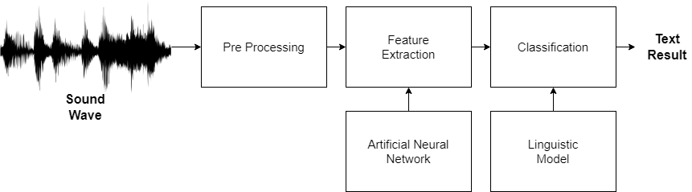

# Core Library

This directory is resposible for managing the library which contains the main functionalities of the _ASR_ (Automatic Speech Recognition)
System. The core library will abstract the main interface which is able to train, test and evaluate the audio data.
The current archtecture of this library contain the following functions:

   
  Basic functioning of an <i>ASR</i> system. The escope of this library should be based solely on this model as well with additional test and training functions.

**Main Classification Pipeline:**
- Pre-processing
    - Noise Reduction
    - Audio Normalization
- Feature extraction
    - Artificial Neural Networks
        - Convolution Neural Network
        - Recurrent Neural Network
- Classification
    - Language model

**Training Pipeline**
- Train based on dataset
- If possible, generate a report about the training

**Testing Pipeline:**
- Test data with a given result
- If possible, generate a report about the testing

### Pre-processing

The pre-processing stage cleans the speech signal in order to make the speech as clear as possible. To do so, it uses a lot of diffirent techniques like audio normalising and noise reduction.

### Feature extraction

The feature extraction stage is responsable for taking the audio signal organize into its most important parts, which may be a word, sillable or phoneme. This proccess can be done in a lot of different ways, but for the current project it will be used __Artificial Neural Networks__ more specifically a _Deep Learning_ model based on a __Convolutional Neural Network__ and a __Recurrent Neural Network.__

### Classification

The classification stage takes the result gathered in the feature extraction stage and relates to the corresponding __Language Model__ unit. The language model can be anything up to phrase, word, sillable or phoneme.

### Convolutional Neural Network

A Convolutional Neural Netork is a kind of _NN_ that is able to process images using a _filter_ or _kernel_, which decreases the processing time spent in order to test or read the image. The _CNN_ is used to read
the _Mel Spectrogram_ of the audio.

### Recurrent Neural Network

A recurrent neural netork is a special kind of _NN_ calculates its result based on iteration, which means it runs inside a loop feeding the last iteration into the current one and so on.